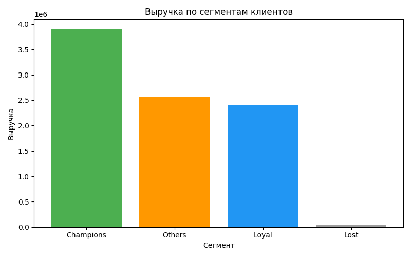
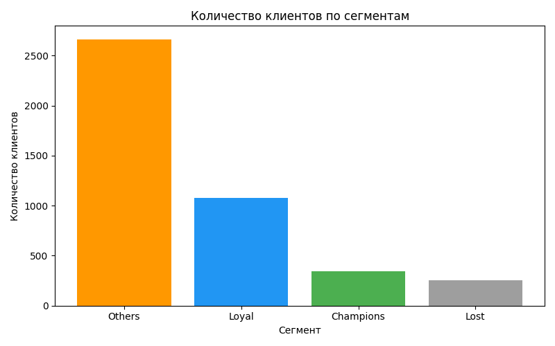
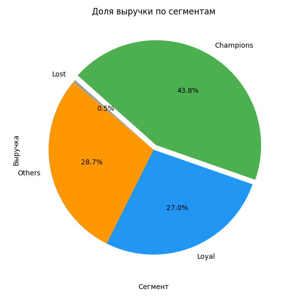

# RFM-анализ клиентов интернет-магазина (PostgreSQL)

Этот проект повторяет бизнес-логику RFM-модели, но акцент сделан на реализации
в SQL (PostgreSQL). В отличие от предыдущего проекта на Python, здесь
основная задача — продемонстрировать владение SQL: работа с таблицами,
чистка данных, агрегаты, оконные функции и экспорт результатов.

## Цель проекта

Провести RFM-анализ на данных интернет-магазина и ответить на ключевые вопросы:

- Какие клиенты приносят наибольшую выручку?
- Как распределяются клиенты по сегментам ценности?
- Какова доля выручки, которую генерируют разные сегменты?

---

## Данные

Использован открытый датасет Online Retail, содержащий транзакции интернет-магазина за период с `2010-12-01` по `2011-12-09`

---

## Структура проекта

### **SQL (main.sql):**

### 1 Подготовка данных
- Импорт CSV в PostgreSQL.
- Замена запятых на точки в колонке UnitPrice для корректного числового формата.
- Создание таблицы sales_data.

### 2 Проверка данных
- Просмотр первых строк
- Проверка структуры таблицы (названия и типы данных)
- Подсчет общего количества записей

### 3 Чистка данных
- Удаление возвратов `(Quantity ≤ 0)`
- Исключение строк с пустым `CustomerID`

### 4 Добавление вычисляемых полей
- Создание поля `total_price = Quantity * UnitPrice`

### 5 Базовая аналитика
- Топ-10 стран по выручке
- Топ-10 товаров по количеству продаж
- Топ-10 клиентов по выручке

### 6 Анализ по времени
- Выручка по месяцам
- Количество заказов по дням

### 7 RFM-анализ и сегментация
- Расчет `Recency, Frequency, Monetary` на уровне клиента
- Присвоение баллов `1–5` по каждой метрике с помощью `NTILE`
- Формирование сегментов:
  - **Champions** — лучшие клиенты
  - **Loyal** — лояльные клиенты
  - **Lost** — потерянные клиенты
  - **Others** — прочие сегменты
- Экспорт агрегатов в CSV для визуализации в Python.

### **Python (main.ipynb):**

### 1 Загрузка CSV с результатами RFM-сегментации

### 2 Подготовка палитры цветов для графиков

### 3 Bar chart: выручка по сегментам

### 4 Bar chart: количество клиентов по сегментам

### 5 Pie chart: доля выручки по сегментам

---

## Примеры визуализаций

  
  
  

---

## Ключевые выводы

- **Сегмент Champions приносит наибольшую часть выручки**, хотя таких клиентов относительно немного.  
- Сегменты **Loyal** и **Others** также вносят заметный вклад, их можно удерживать дополнительными предложениями.  
- Сегмент **Lost** практически не влияет на выручку — работа с ними может быть нерентабельной.  
- Использование SQL позволило быстро подготовить данные и провести сегментацию, а визуализация в Python сделала результаты наглядными. 

---

## Как открыть

Файл `main.ipynb` можно открыть через:
- Jupyter Notebook  
- VS Code с расширением Jupyter  

Файл `main.sql` можно открыть и выполнять через:
- pgAdmin  
- VS Code с расширением PostgreSQL  
- psql (терминал PostgreSQL)  

---

## Что можно улучшить

- Добавить анализ по странам и категориям товаров внутри сегментов.  
- Расширить RFM-сегментацию (например, добавить "Potential Loyalists" или "At Risk").  
- Автоматизировать обновление сегментов и экспорт CSV по расписанию.  

---

## Навыки, показанные в проекте

- Работа с PostgreSQL: создание таблиц, очистка данных, агрегаты, оконные функции (`NTILE`, `DATE_TRUNC`, `EXTRACT`).  
- Расчет RFM-метрик (Recency, Frequency, Monetary) и сегментация клиентов.  
- Экспорт данных из SQL в CSV для визуализации.  
- Визуализация данных в Python (`pandas`, `matplotlib`).  
- Формулировка бизнес-выводов на основе сегментации клиентов.  